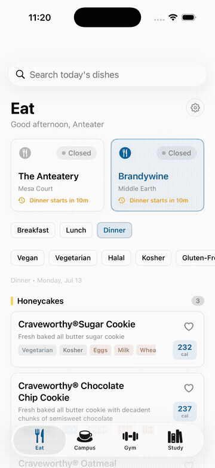
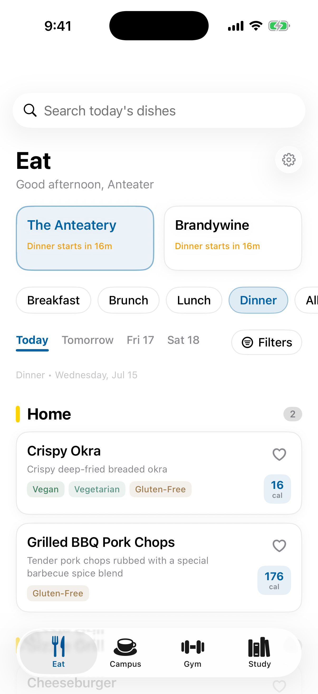
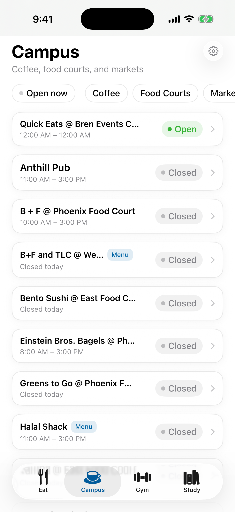
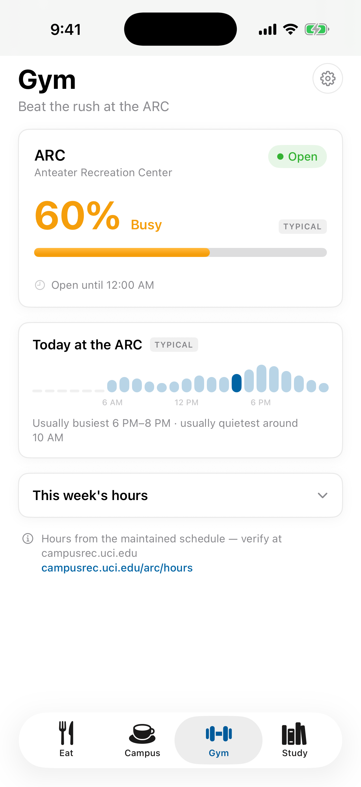
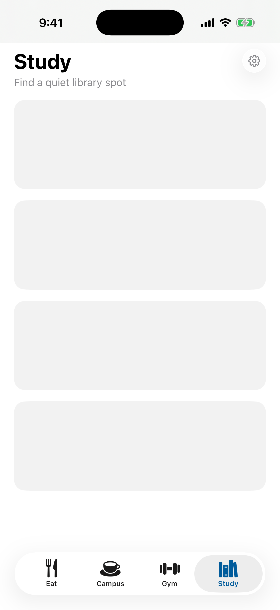
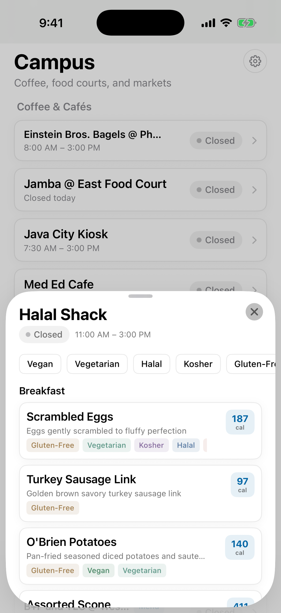
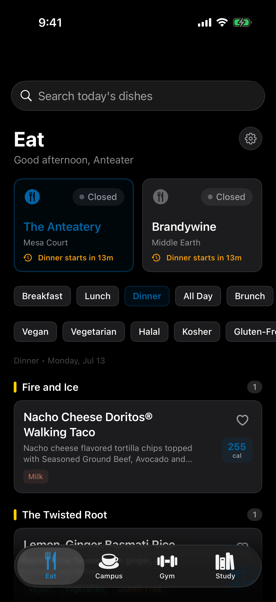
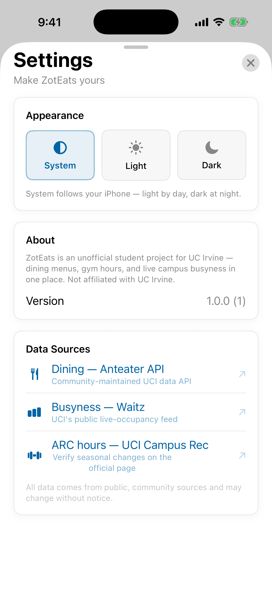

<div align="center">

# ZotEats 🐜

**UCI dining, campus food, gym, and study spots — in one native iOS app.**

*Menus with nutrition and dietary filters · live library busyness · rush-hour intelligence · built by an Anteater, for Anteaters.*

[](https://github.com/atharvgups/zoteats/actions/workflows/ios.yml)


**[Try it on TestFlight →](https://testflight.apple.com/join/pr1XtuTx)**



</div>

---

## What it does

<p align="center">
  
  
  
  
</p>

- **Eat** — live menus for The Anteatery & Brandywine with calories, allergens, and Vegan / Vegetarian / Halal / Kosher / Gluten-Free filtering. Countdowns like "Dinner starts in 16m", browse tomorrow's menu, and the app opens on whichever meal is happening right now.
- **Campus** — every campus food spot (Starbucks, Panda Express, Subway, Zot N Go, the food courts) with real hours and open/closed. Filter by category or "open now"; chains collapse into one expandable row; menus where venues publish them.
- **Gym** — busyness-first ARC view: how packed it is now, today's rush curve, and when it's usually quietest. Hours tucked away where they belong.
- **Study** — live library occupancy from UCI's Occuspace sensors, floor by floor, with a "quietest right now" pick.

**Plus:** full dark mode (follow the system or force it), a home-screen widget, favorites that surface when your dish is being served, dish detail sheets with nutrition, and a few hidden Zots for the curious. 🐜🐜🐜

<p align="center">
  
  
  
</p>

## Data sources

All data is live from public, community-maintained UCI sources. No accounts, no ads, no tracking — preferences never leave your device.

| What | Source |
|---|---|
| Dining hall menus, hours, nutrition | [Anteater API](https://anteaterapi.com) (`/v2/rest/dining`) — the maintained UCI data API |
| Campus restaurant hours & menus | UCI Dining hub (`uci.mydininghub.com`) public backend |
| Library busyness | UCI's [Occuspace pilot](https://www.lib.uci.edu/library-space-usage-pilot) via the public Waitz feed |
| ARC hours | Maintained schedule, verified against [campusrec.uci.edu](https://www.campusrec.uci.edu/arc/hours.html) |

Where no sensors exist (dining halls, the ARC), busyness shows **typical patterns** — clearly tagged `TYPICAL` — derived from real meal windows and known rush patterns. Live sensor data automatically takes over anywhere coverage appears.

## Architecture

```
apple/
├── ZotEatsKit/     Swift package: models, API services, caching,
│                   typical-busyness engine — 46 tests, runs on Linux + macOS
├── App/            SwiftUI app (iOS 17+): Eat / Campus / Gym / Study
│                   + a Notion-inspired design system
├── UITests/        Scripted demo tour, recorded on video by CI
└── project.yml     XcodeGen spec (the Xcode project is generated, not committed)
```

- **Swift 6** with strict concurrency, `@Observable` stores, no external dependencies.
- **CI** builds the app on macOS runners, captures light + dark screenshots of every screen, and records a full demo video on `[demo]` commits. Package tests run on every push.
- **TestFlight** releases ship by pushing a `testflight-x.y.z` tag.
- The repo root also contains the original [Glaze](https://glazeapp.com) desktop prototype this project grew out of.

## Development

```bash
# Data layer tests (works on Linux and macOS)
swift test --package-path apple/ZotEatsKit

# Include live-API smoke tests
ZOTEATS_LIVE_TESTS=1 swift test --package-path apple/ZotEatsKit

# Generate the Xcode project (macOS)
brew install xcodegen
xcodegen generate --spec apple/project.yml --project apple/
open apple/ZotEats.xcodeproj
```

## Roadmap

- Home-screen widget (what's open + quietest spot at a glance)
- Favorite-dish notifications ("chicken tikka is at Brandywine today")
- Browse future days' menus
- Real dining-hall and ARC busyness, the moment sensors exist for them

## Disclaimer

ZotEats is an unofficial student project and is not affiliated with UC Irvine. Data comes from public endpoints that may change without notice. Zot responsibly.
