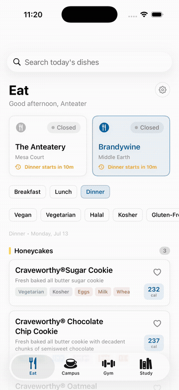
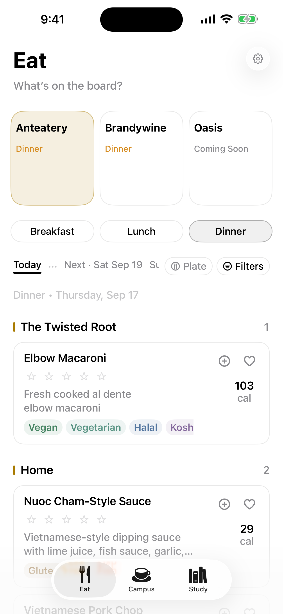
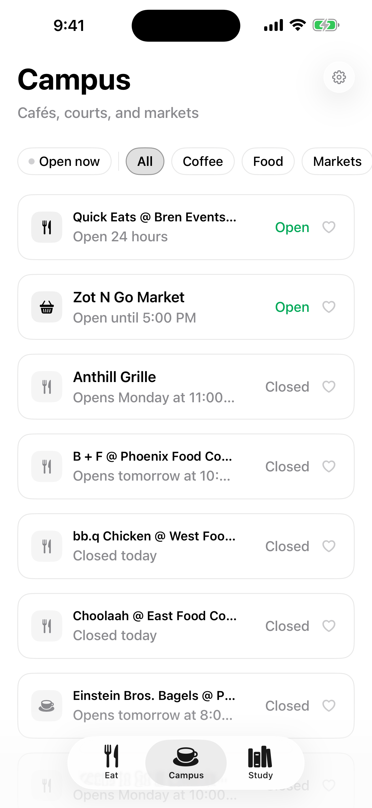
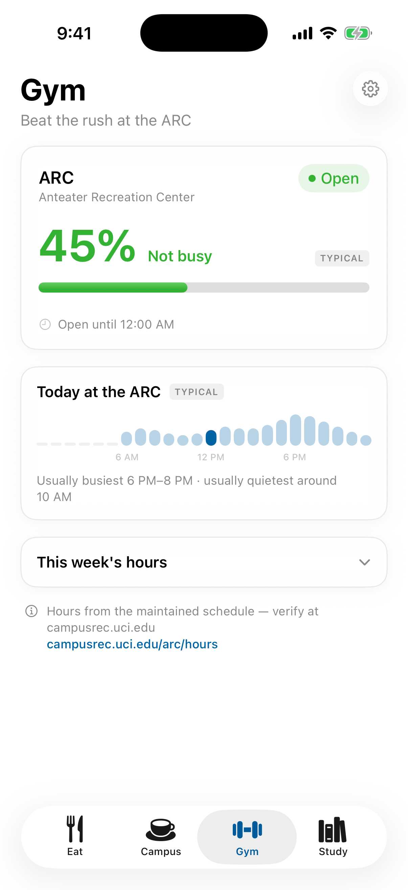
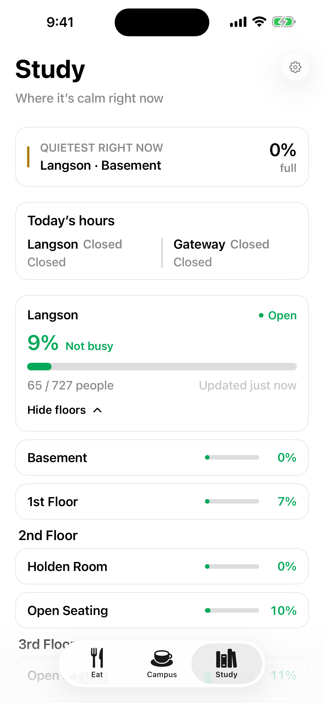
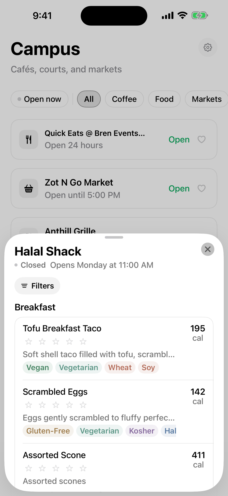
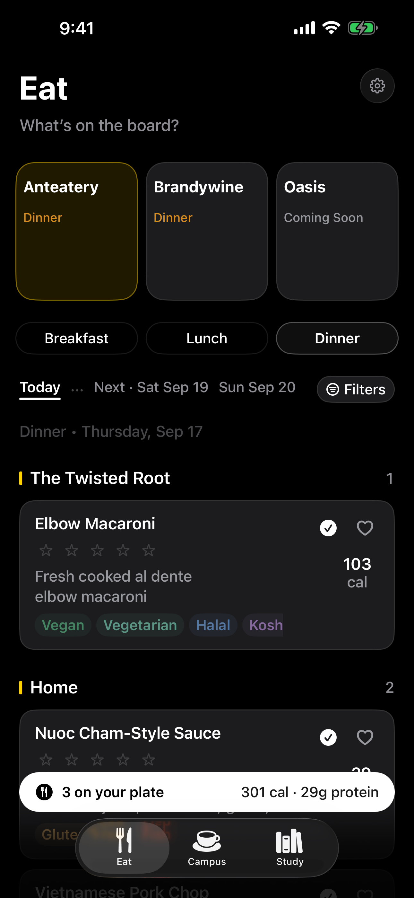
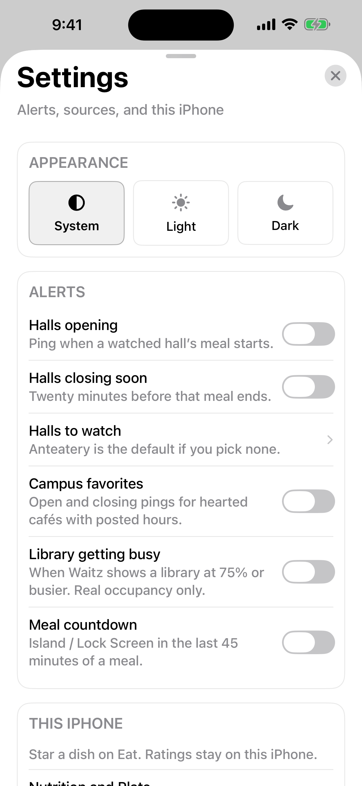

<div align="center">

# ZotEats

**Native iOS for UCI campus life** — dining menus, campus food spots, ARC rush, and live library busyness.

*Built by an Anteater ([Atharv Gupta](https://github.com/atharvgups)), for Anteaters. Unofficial — not affiliated with UC Irvine.*

[](https://github.com/atharvgups/zoteats/actions/workflows/ios.yml)




</div>

---

## Features

<p align="center">
  
  
  
  
</p>

| Tab | What you get |
|---|---|
| **Eat** | Live menus for The Anteatery & Brandywine — calories, allergens, Vegan / Vegetarian / Halal / Kosher / Gluten-Free filters. Opens on the meal happening now; browse upcoming days; search dishes; heart favorites. |
| **Campus** | Starbucks, Panda, Subway, Zot N Go, food courts, and more — hours, open/closed, category + “open now” filters. Chains group into one row; menus when venues publish them. |
| **Gym** | ARC first: how packed it is, today’s rush curve, when it’s usually quietest. Hours stay secondary. |
| **Study** | Live library occupancy (Occuspace via Waitz), area-by-area where reported, plus a “quietest right now” pick. |

**Also shipped**

- Favorite-dish **alerts** — local notification when something you’ve hearted is on today’s menu
- **Live Activity** / Dynamic Island countdown for the meal you’re in (“Dinner ends in…”)
- Home-screen **widget** — hall open state + quietest library (medium)
- Dish detail sheets with nutrition · system / light / dark appearance · a few hidden Zots 🐜

<p align="center">
  
  
  
</p>

No accounts. No ads. No tracking. Preferences stay on device.

---

## Data

| What | Source |
|---|---|
| Dining hall menus, hours, nutrition | [Anteater API](https://anteaterapi.com) |
| Campus restaurant hours & menus | UCI Dining hub (`uci.mydininghub.com`) public backend |
| Library busyness | [Occuspace pilot](https://www.lib.uci.edu/library-space-usage-pilot) via [Waitz](https://waitz.io/irvine) |
| ARC hours | Maintained schedule, checked against [campusrec.uci.edu](https://www.campusrec.uci.edu/arc/hours.html) |

Where sensors don’t exist (dining halls, ARC), busyness is a **typical** pattern — tagged `TYPICAL` in-app. Live Waitz data takes over when a facility is covered.

---

## Stack

- **SwiftUI** app (iOS 18+), bundle id `com.atharvgupta.zoteats`
- **Swift 6** · `@Observable` stores · WidgetKit + ActivityKit · no third-party packages
- **`ZotEatsKit`** — shared Swift package (models, dining / campus / gym / busyness services, caching, typical-busyness engine). Fixture tests run on Linux and macOS.
- **XcodeGen** — `.xcodeproj` is generated, not committed
- CI builds on macOS, screenshots every screen, records a demo video on `[demo]` commits; TestFlight uploads on `testflight-*` tags

```
apple/
├── App/            SwiftUI tabs: Eat · Campus · Gym · Study
├── Widgets/        Home-screen widget + meal Live Activity
├── ZotEatsKit/     Data layer + tests
├── UITests/        Scripted demo tour (CI video)
├── AppStore/       Listing draft + privacy policy
└── project.yml     XcodeGen spec
```

The repo root still holds the earlier [Glaze](https://glazeapp.com) desktop prototype this project grew out of.

---

## Build & run

**Requirements:** macOS, Xcode (iOS 18 SDK), [XcodeGen](https://github.com/yonaskolb/XcodeGen).

```bash
# Data-layer tests (Linux or macOS)
swift test --package-path apple/ZotEatsKit

# Optional live-API smoke tests
ZOTEATS_LIVE_TESTS=1 swift test --package-path apple/ZotEatsKit

# Generate project and open in Xcode
brew install xcodegen
xcodegen generate --spec apple/project.yml --project apple/
open apple/ZotEats.xcodeproj
```

Run the **ZotEats** scheme on a simulator or device. Set your Apple Development Team in the project if you need device signing (`DEVELOPMENT_TEAM` in `apple/project.yml`).

More detail: [`apple/README.md`](apple/README.md).

---

## TestFlight

Beta builds upload when you push a tag like `testflight-1.0.0` (or via manual workflow dispatch). See [`.github/workflows/testflight.yml`](.github/workflows/testflight.yml). Watch the repo / TestFlight for invites — still beta.

---

## Status & disclaimer

**Beta.** Unofficial student project — not affiliated with, endorsed by, or sponsored by UC Irvine, UCI Dining, or Campus Recreation. Public endpoints can change; always verify critical hours on official UCI channels.

Zot responsibly.
