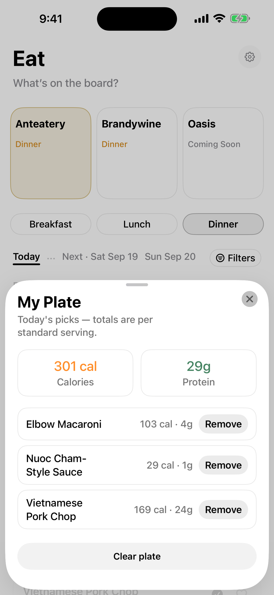
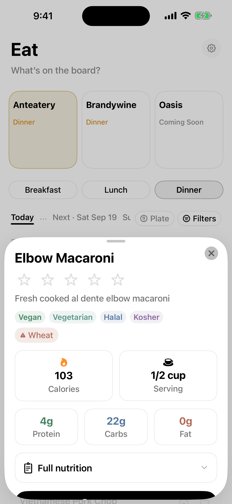

<div align="center">

# Anteats

**UCI dining, campus food, and a quiet place to study, in one native iOS app.**

On the App Store (~1.0.298). Built by [Atharv Gupta](https://github.com/atharvgups). Unofficial. Not affiliated with UC Irvine.

[](https://github.com/atharvgups/zoteats/actions/workflows/ios.yml)


Search **Anteats** on the App Store. The GitHub repo is `zoteats`.

</div>

<p align="center">
  
  
  
  
</p>

## What it does

**Eat:** Anteatery, Brandywine, and Oasis (coming soon until menus go live). Three text-first hall tiles, larger Breakfast / Lunch / Dinner pills, and a subtitle that follows the meal you picked. On-device Apple Intelligence when the phone can do it, a static line when it can’t. My Plate, dietary filters, a card per station, favorites. Twisted Root sits first when you want the vegan option.

**Study:** Langson and Gateway, with today’s hours. Libraries start collapsed; open a card to see floor-level busyness. Chevrons point right when a section is closed and down when it’s open.

**Campus:** On-campus places as their own cards. Starbucks, Panda, Subway, and similar spots show a standard menu when we have one; everyone else links to the official online menu when a live scrape isn’t reliable.

**Widgets:** A handful of WidgetKit glances (about five or six): dining halls, today’s menu, favorites on the board, campus open now, quietest library. Enough to check without opening the app. Not a gallery.

**Notifications:** Dining and campus alerts that stay useful: a favorite on today’s board, a hall about to open or close, a library getting busy. No spam.

**Settings:** Standard iOS switches. System type (SF Pro). Light is plain white; dark is plain black.

<p align="center">
  
  
  
  
</p>

No accounts. No ads. No tracking. Preferences and My Plate stay on this iPhone.

## Stack

- **SwiftUI** app (iOS 18+), display name Anteats, bundle id `com.atharvgupta.zoteats`
- **Swift 6**, WidgetKit, App Groups so the app and widgets share an on-device cache
- **`ZotEatsKit`:** shared Swift package for models, dining / campus / library services, and tests
- **XcodeGen:** the Xcode project is generated, not committed
- **TestFlight** for internal dogfood (ahead of the store, ~1.0.308)

Live data comes from public campus feeds: [Anteater API](https://anteaterapi.com) for dining-hall menus, UCI Dining Hub for campus retail, [Waitz](https://waitz.io/irvine) for library busyness, and UCI LibCal for library hours.

## Build & run

**Requirements:** macOS, Xcode (iOS 18 SDK), [XcodeGen](https://github.com/yonaskolb/XcodeGen).

```bash
# Data-layer tests (Linux or macOS)
swift test --package-path apple/ZotEatsKit

# Optional live-API smoke tests
ZOTEATS_LIVE_TESTS=1 swift test --package-path apple/ZotEatsKit

# Generate the project and open it
brew install xcodegen
xcodegen generate --spec apple/project.yml --project apple/
open apple/ZotEats.xcodeproj
```

Run the **ZotEats** scheme on a simulator or device. The home screen says Anteats. Set your Apple Development Team in `apple/project.yml` if you need device signing.

## Author

Anteats is an unofficial student project by [Atharv Gupta](https://github.com/atharvgups). It is not affiliated with, endorsed by, or sponsored by UC Irvine. Public endpoints can change. Check official UCI channels when hours or menus matter.
